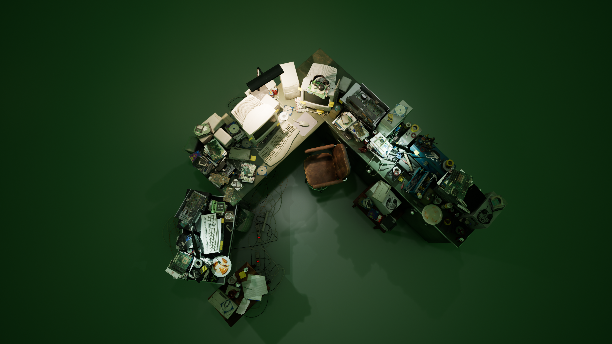
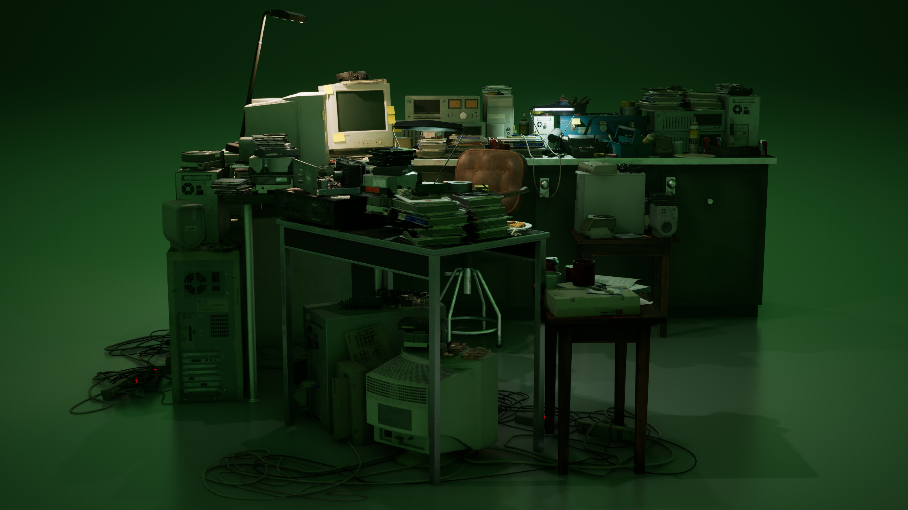
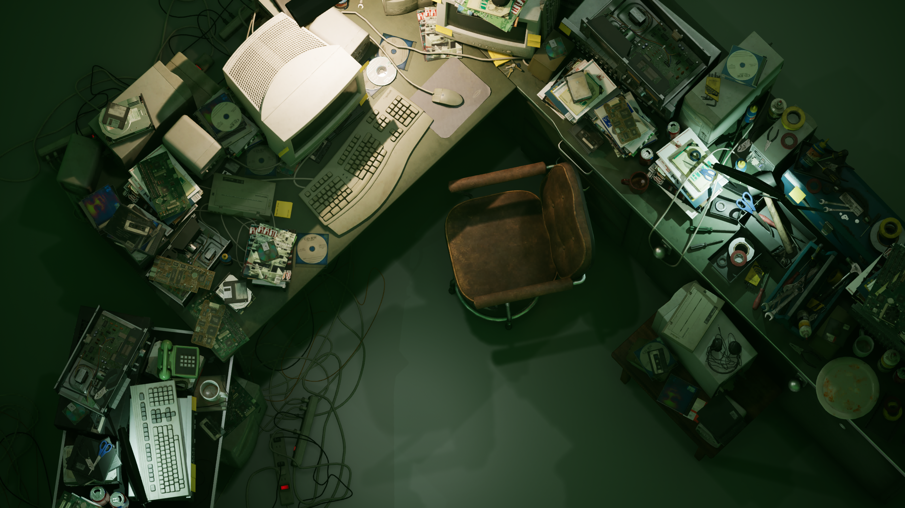
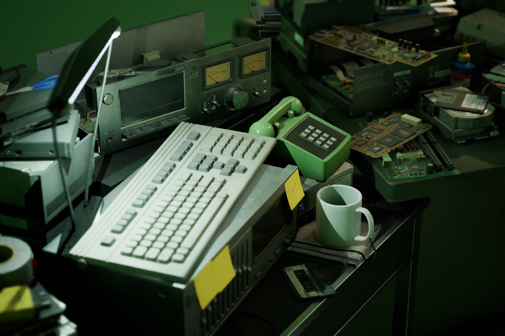
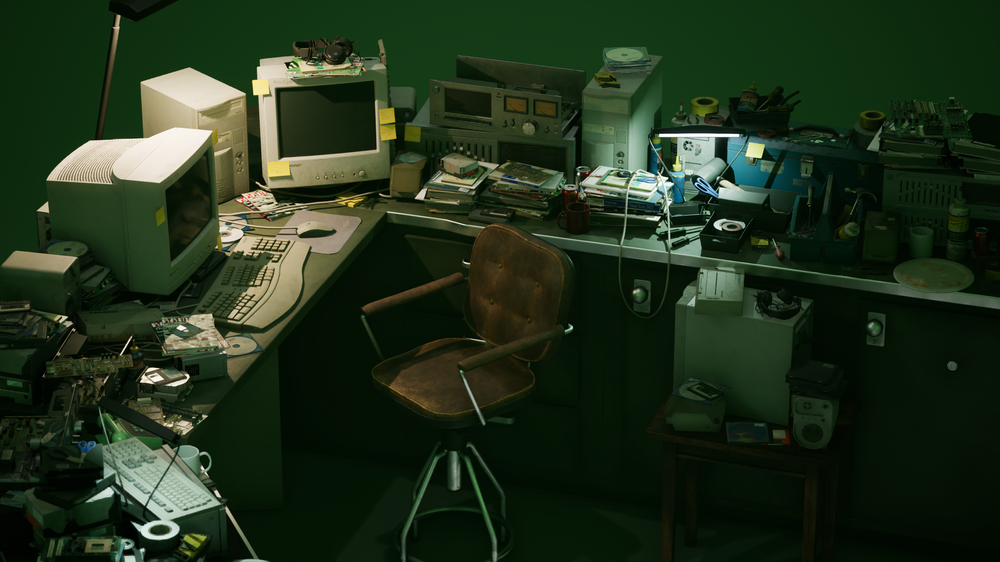
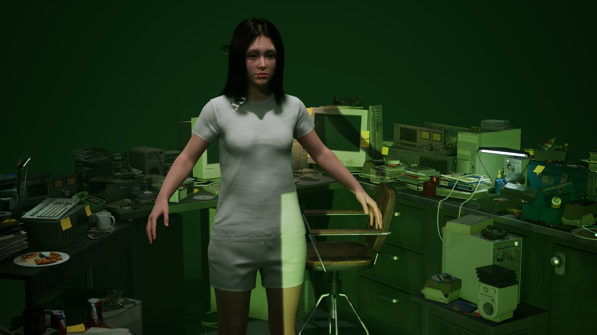
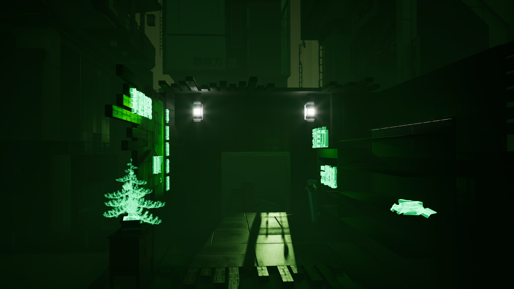
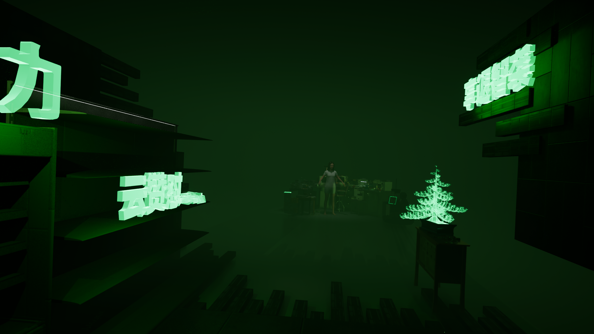
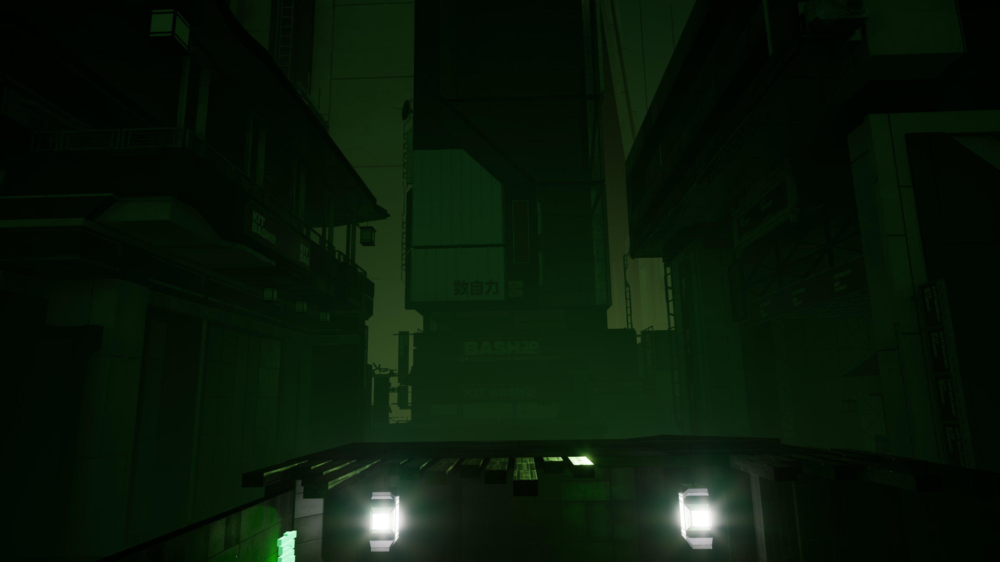

# LLM-NPC: The Memory Archive

Huizinga (1938) defined play as activity bounded by an agreed set of rules, set apart in time and space from ordinary life, and called this rule-bound region the magic circle. Caillois (1958) extended the framework with a taxonomy of four play modes: *agon* (competition), *alea* (chance), *mimicry* (role-play and simulation), and *ilinx* (vertigo). An NPC whose every line is generated at runtime by a large language model presents a specific problem for both frames, since the model is trained on the real world and its outputs can puncture the magic circle from inside the character it is performing.

A research prototype implementing a conversational, emotionally-aware MetaHuman NPC in Unreal Engine 5.7. All NPC dialogue is generated at runtime by the Anthropic Claude API. Speech-to-text is handled by OpenAI Whisper, text-to-speech by ElevenLabs v3, and facial / body animation by a combination of FACS curves, ARKit eye-look curves, MetaHuman template animations, and procedural FK head turns.

The current vertical slice is titled *The Memory Archive*. It contains one fully-realised NPC (referred to in-fiction as "The Friend") inside a single playable scene (`Threshold_Compound.umap`). The slice is the basis for an academic / portfolio final review and for a workshop submission framed as speculative design on the topics of consent, witness, and model-mediated testimony.

## Status

| Component | Status |
|---|---|
| Tier 0: Item interaction types, prompt sections, gesture wiring | Complete (2026-04-29) |
| Tier 1: First-person pawn, E/F/Q item verbs, VAD, ElevenLabs v3 | Complete (2026-04-30) |
| Tier 2: Whisper PCM hook, speaker identification, eye tracking | Complete (2026-04-30) |
| Tier 3: Per-speaker trust, three-branch resolution, logger | Pending |
| Tier 4: Polish (post-process, hand material, console prop) | Pending |

## Recorded Demos

Three recorded walkthroughs are hosted on YouTube. The source `.mp4` files also exist under `docs/videos/`, which is gitignored due to file size (approximately 2.77 GB total), and can be played through the local kiosk page at `docs/MemoryArchive_Hub.html`.

| | | |
|---|---|---|
|  |  |  |
| **[The Loop](https://youtu.be/0OsRNkl08sg)** | **[Item Inspect](https://youtu.be/m_M3sxvgzrs)** | **[Ending](https://youtu.be/nte8GFPLTYU)** |
| One conversational turn from microphone capture through MetaHuman response. | Object pickup (E), presentation (F), and the corresponding change in NPC response. | Trust accrual and the consent-revocation ending. |

## Screenshots

Twelve in-engine screenshots are stored at `docs/MemoryArchive_Slideshow_Export/images/HighresScreenshot00001.png` through `HighresScreenshot00012.png`. Additional environment reference images are stored under `docs/presentation/images/`.

| | | |
|---|---|---|
|  |  |  |
|  |  |  |
|  |  |  |
|  |  |  |

## Implemented Systems (Current Vertical Slice)

### 1. Conversational Pipeline

Each player turn follows a fixed sequence:

1. Microphone capture via the Windows `waveIn` API at 16 kHz, 16-bit, mono. The microphone opens once at PIE entry and remains open for the session.
2. Voice activity detection. A custom VAD samples the last 200 ms of PCM amplitude on each component tick. After a minimum of 300 ms of speech followed by 1 second of silence, the buffer is snapshotted under a lock, encoded as WAV, and sent to Whisper. The `waveIn` session continues uninterrupted.
3. Speaker identification (see section 2 below) runs on the raw PCM before WAV encoding.
4. System prompt assembly from `UNPCGraphDataAsset`. Ten sections are constructed in `DialogueComponent::BuildSystemPromptFromGraph`, covering identity, player relationship, event context, knowledge, withheld content, memory quality, outgoing relationship edges, tonal register, brevity, and the apparatus / soft-doubt instructions.
5. POST to the Claude `/v1/messages` endpoint, default model `claude-sonnet-4-6`.
6. Response parsing. Claude returns structured JSON containing a `dialogue` string, an `emotion_update` block (Plutchik deltas), and an optional `item_give` field.
7. Parallel dispatch of the response: ElevenLabs v3 TTS request (audio plus character-level alignment), `EmotionComponent` update, MetaHuman facial pose update via FACS curves, lip sync via the alignment data, and body animation state transition.

Rate limiting is set at 0.5 seconds between Claude calls, with exponential backoff (3 retries, 1s / 2s / 4s with ±25% jitter).

### 2. Speaker Identification

`USpeakerIdentificationComponent` subscribes to a new `OnPCMCaptured` delegate on `WhisperSTTComponent`, broadcast before WAV encoding. The component performs the following per utterance:

1. Locate the contiguous 4096-sample window with the highest summed energy (256-sample stride). This avoids fingerprinting on leading silence.
2. Compute a Hann-windowed magnitude spectrum at 64 frequency bins using a hand-rolled discrete Fourier transform.
3. Sum the bins into four bands (0–500 Hz, 500–1500 Hz, 1500–3000 Hz, 3000–8000 Hz) and L2-normalise.
4. Compare against existing `FSpeakerProfile` centroids by cosine similarity. If the best match exceeds 0.85, that profile is updated by running average and the speaker's tag is broadcast. Otherwise, a new profile is enrolled (capped at 2 profiles by default).
5. Number keys `1` and `2` allow manual override of the next utterance's tag and train that profile on the actual voice.

The resolved tag is prepended to user messages as `[Speaker_X is speaking]` before they are sent to Claude. The system prompt contains a per-speaker register paragraph that instructs the NPC to address each speaker distinctly. Per-speaker memory is stored in two non-UPROPERTY maps on `DialogueComponent`: `TMap<FName, TSet<FName>> InspectedBy` and `PresentedBy`, keyed by item ID.

The discrete Fourier transform is hand-rolled rather than using UE's `Audio::FFFTAlgorithm` to avoid a `SignalProcessing` module dependency. The computational cost is approximately 524k operations per utterance (4096 samples × 64 bins × 2 trigonometric multiplications), executed once per VAD dispatch.

### 3. Object Interaction

Seven `AInspectableItem` actors are placed in the back-room area of the scene. Each carries four narrative fields: `ItemDisplayName`, `ItemWorldDescription` (the visible description, injected into the Claude prompt when the item is presented), `NPCKnowledgeText` (the NPC's private knowledge of the object), and `ItemID` (an FName used for topic-gate matching).

The seven items are: `old_photograph`, `phone_book`, `letter`, `cash_stack`, `jade_pendant`, `chessboard`, `bonsai_tree`.

Three input verbs are bound on `ANPCPlayerController`:

| Key | Action |
|---|---|
| `E` | Line-trace pickup at 300 cm against the `ECC_Visibility` channel. The held item is reparented to follow the camera (offset 70 / 15 / -15 cm) each tick. Inspection is recorded silently to `InspectedBy[ItemID]` for the current speaker. No Claude turn fires. |
| `F` | Present the held item. A structured payload (`[The visitor presents to you: {Name}. The item is now in your sightline. They see: {ItemWorldDescription}. Your private knowledge of this object: {NPCKnowledgeText}]`) is injected into the next Claude call. `PresentedBy[ItemID]` is updated for the current speaker. |
| `Q` | Drop the held item back to its original transform. |

Right-mouse-button drag yaw-rotates the held item (mouse Y is intentionally ignored). Camera look is disabled while the right mouse button is held to prevent the viewport from moving during inspection. The scroll wheel scales the held item.

Speaking while holding an item annotates the user message with a `[Currently holding: ...]` block, which threads the same description and knowledge text into the Claude call. This is distinct from a formal Present: section 7.10 of the system prompt instructs the NPC to be curt on first Present but to divulge more on subsequent speech with held context.

### 4. Topic Gating

The system prompt contains a hard-gated topic matrix. Each topic requires both an item gate (one or more items inspected and / or presented) and a per-speaker trust threshold. Topics not yet unlocked are silently deflected via subject change. The current matrix is:

| Topic | Item gate | Emotion gate |
|---|---|---|
| "Ashley came that night" | Photograph and Phone Book inspected | Trust ≥ 0.3 (active speaker) |
| "She was wearing her grandmother's pendant" | Jade Pendant inspected | Trust ≥ 0.3 |
| "She asked for money" | Stack of Cash and Phone Book inspected | Trust ≥ 0.4 |
| "There was a letter" | Phone Book inspected | Trust ≥ 0.5 |
| "I have kept the letter" | Letter presented (not merely inspected) | Trust ≥ 0.6 |
| "We were closer than I have said" | Chinese Chessboard inspected | Trust ≥ 0.4 |
| "I have not stopped grieving" | Bonsai Tree inspected | Trust ≥ 0.5 (any speaker) |

The keystone topic is gated on Present rather than Inspect, on the design rationale that formally showing the letter is a different act from privately viewing it.

### 5. Soft Doubt

The NPC's default posture when asked about a topic for which the player has shown no source is to ask, briefly, how the player came to know. The behaviour is implemented entirely in the system prompt (section 7.10); there is no C++ doubt-detection logic. Inspecting the relevant item privately removes the doubt. Presenting the item makes acknowledgment full. Sufficiently grounded or specific phrasing can also override the doubt without item evidence.

The same prompt section establishes that the NPC is aware she exists in the archive as a reconstruction of her own prior interviews, that the player's robotic hands are visible to her, and that she may revoke consent on the source's behalf if the conversation becomes unsafe.

### 6. Emotion Engine

`EmotionComponent` implements a continuous Plutchik-plus-PAD state machine. Each `emotion_update` block from Claude is integrated into the current state and decays toward Neutral at a configurable rate (`EmotionDecayRate = 0.015`, approximately 65 seconds to neutral from full intensity). Per-emotion transition costs are sourced from `UNPCConfigDataAsset` and modelled on the GOAP precondition-and-effect formulation in Orkin (2006).

The PAD vector drives three downstream systems:

1. FACS facial blend-shape weights, written to the MetaHuman Face AnimBP via the Set Control interface (`MetahumanAnimComponent`).
2. ElevenLabs voice stability and style modulation per request.
3. MetaHuman template body animation selection through `UTemplateAnimationDriverComponent` (Idle, Happy A/B, Sad A/B, Anger A/B, Fear A/B, Surprise A/B). The driver returns to Idle 1.75 seconds after `OnSpeechFinished` so the NPC does not remain locked in a one-shot template.

### 7. Facial Subsystems

| Subsystem | Component | Mechanism |
|---|---|---|
| FACS curves | `MetahumanAnimComponent` | Emotion-to-blend-shape weights via `UBlendShapeMappingDataAsset`, with a 4 FPS curve interpolation rate. Coexists with RigLogic. |
| Lip sync | `NPCLipSyncComponent` | ElevenLabs character-level timestamps mapped to visemes via `PhonemeVisemeMapper`. Asymmetric smoothing (closure 50/s, open 7/s). |
| Eye tracking | `NPCEyeTrackingComponent` | Per `TG_PostUpdateWork` tick, the player camera direction is projected into the NPC's local head frame, clamped to a 70° yaw / 35° pitch peripheral cone, and written to the eight ARKit `eyeLookOut_L/R`, `eyeLookIn_L/R`, `eyeLookUp_L/R`, `eyeLookDown_L/R` curves. Smooth return to neutral outside the cone. |
| Lip-sync echo gate | `WhisperSTTComponent` | A gate flag is set on TTS start and cleared after a configurable cooldown past TTS end. Gated PCM samples are dropped on the audio thread before `RecordedPCM->Append`. Prevents the NPC's own voice from feeding back into the next transcript. |

### 8. Player and HUD

`ANPCPlayerController` provides first-person mouse-look, WASD movement, crouch (Left Ctrl), the three item verbs, the manual speaker override keys, and `T` to toggle the chat overlay for typed input fallback.

`NPCDialogueHUD` draws a top-bar archive frame, a speaker chip (top-left, `SPEAKER A · 0.92` format), an item interaction hint near the reticle, and a compact dialogue overlay for click-to-focus typing. The overlay defaults to hidden so the application opens in first-person look mode.

Focus selection between NPCs is handled by `UpdateNPCFocus` on the player controller with hysteresis: focus is gained at distance ≤ `InteractionRadius` and facing dot ≥ 0.1, and kept at distance ≤ `InteractionRadius * 1.25` and facing dot ≥ -0.3. This prevents sub-degree mouse-look jitter from flipping focus tick-to-tick.

## Architecture

| Layer | Component | LOC | Role |
|---|---|---:|---|
| Dialogue | `ClaudeAPISubsystem` | 368 | HTTP, rate-limit, exponential backoff, JSON parse. |
| | `DialogueComponent` | 251 | Graph-driven system prompt assembly, per-speaker memory, soft-doubt prompt section. |
| | `WhisperSTTComponent` | 453 | `waveIn` capture, VAD silence segmentation, echo gate, `OnPCMCaptured` delegate. |
| | `SpeakerIdentificationComponent` | new | 4-band spectral fingerprint, cosine match, auto-enrol up to 2 speakers. |
| | `ElevenLabsTTSComponent` | 479 | v3 TTS with character-level alignment, request versioning for deduplication. |
| Emotion | `EmotionComponent` | n/a | Plutchik plus PAD state, decay, transition costs. |
| Vision | `FacialRecognitionComponent` | 253 | ~10 FPS ONNX expression classifier (ambient, non-gating). |
| | `GestureRecognitionComponent` | 253 | ~15 FPS ONNX hand-landmark classifier. |
| Animation | `MetahumanAnimComponent` | 864 | FACS curve pipeline, thinking pose, jaw, blink. |
| | `NPCLipSyncComponent` | 419 | ElevenLabs alignment to visemes. |
| | `NPCBodyMotionComponent` | 794 | 4-state FSM (Idle, Thinking, Speaking, Reacting), procedural micro-motion, head-turn additive. |
| | `NPCEyeTrackingComponent` | new | ARKit eye-look curves with peripheral cone tracking. |
| | `TemplateAnimationDriverComponent` | new | Emotion to MetaHuman template animation, auto-Idle return. |
| World | `AInspectableItem` | n/a | Narrative payload (`ItemDisplayName`, `ItemWorldDescription`, `NPCKnowledgeText`, `ItemID`). |
| Player | `ANPCPlayerController` | n/a | First-person movement, E/F/Q/RMB/1/2 input, held-item tracking, focus hysteresis. |
| | `NPCDialogueHUD` | n/a | Speaker chip, item hint, archive top-bar, click-to-focus chat. |

Data-driven configuration is split into two asset types. `UNPCConfigDataAsset` carries per-character settings (Claude model ID, ElevenLabs voice ID, voice stability, emotion baseline, decay rate, per-emotion transition costs). `UNPCGraphDataAsset` carries per-playthrough state (event summary, ground truth, hidden titles, nodes with role and relationships, edges with relationship descriptions and trust levels). One handcrafted graph is shipped for the slice: `Content/THRESHOLD/DA_Graph_ThresholdDefault.uasset`.

## Technology

| Layer | Technology |
|---|---|
| Engine | Unreal Engine 5.7, C++ |
| LLM | Anthropic Claude API (`/v1/messages`, `claude-sonnet-4-6`) |
| STT | OpenAI Whisper (`/v1/audio/transcriptions`) |
| TTS | ElevenLabs v3 (`with-timestamps` endpoint, inline audio tags) |
| Vision | OpenCV 4.x DNN, ONNX Runtime |
| Character | MetaHuman with RigLogic, template body animations, procedural FK head turn |
| Audio capture | Windows `waveIn` API |
| Audio analysis | Hand-rolled DFT, no `SignalProcessing` module dependency |

## Setup

1. Clone the repository.
2. Place third-party libraries in `ThirdParty/{whisper.cpp,OpenCV,ONNXRuntime}/{include,lib}`. The build script (`LLM_NPC.Build.cs`) auto-detects them and conditionally compiles with `WITH_WHISPER`, `WITH_OPENCV`, `WITH_ONNXRUNTIME`.
3. Place ONNX models in `Content/Models/`: `fer_expression.onnx` (~10 MB) and `hand_landmark.onnx` (~5 MB).
4. Set the following environment variables: `ANTHROPIC_API_KEY`, `OPENAI_API_KEY`, `ELEVENLABS_API_KEY`.
5. Open `LLM_NPC.uproject`, regenerate project files, build `LLM_NPC` and `LLM_NPCEditor` targets.
6. Open `Content/Maps/Threshold_Compound.umap` and press Play In Editor.

The MetaHuman mesh assigned to `BP_NPC_Friend` lives under `Content/THRESHOLD/MetaHuman/`. This directory is gitignored because individual `.uasset` files routinely exceed GitHub's 100 MB per-file cap. The mesh can be re-downloaded from Quixel Bridge or MetaHuman Creator and rebound to `BP_NPC_Friend` after import.

## Static HTML Deliverables

The repository contains five static HTML files under `docs/`. They require no build step and open directly from the local filesystem.

| File | Purpose |
|---|---|
| [`docs/MemoryArchive_Hub.html`](docs/MemoryArchive_Hub.html) | Three-section interactive kiosk with embedded video playback. |
| [`docs/MemoryArchive_Slideshow.html`](docs/MemoryArchive_Slideshow.html) | Auto-advancing 12-screenshot slideshow. |
| [`docs/MemoryArchive_Poster.html`](docs/MemoryArchive_Poster.html) | A4 print-ready technical poster. |
| [`docs/MemoryArchive_ElevatorPitch.html`](docs/MemoryArchive_ElevatorPitch.html) | Six-beat spoken pitch card, approximately 1:45 read-aloud. |
| [`docs/MemoryArchive_Controls.html`](docs/MemoryArchive_Controls.html) | Keyboard shortcut quick-reference card. |

## Future Work

The vertical slice was scoped down from a five-NPC compound design to one NPC for the final review. The deferred systems are documented below for completeness.

### Tier 3 (Next Milestone)

1. Per-speaker trust estimate derived from `InspectedBy` and `PresentedBy` plus emotional engagement.
2. Deterministic branch-eligibility hint (section 7.7) prepended to the system prompt each turn. The hint computes per-speaker turn counts, gesture intent rolling averages, items inspected and presented per speaker, and per-speaker trust estimates.
3. Section 7.9 climax instruction. Claude determines the resolution branch from three options:
   - **Convergent Disclosure**: both speakers reach trust ≥ 0.5, tonal registers aligned, keystones presented in coordinated order. The NPC gives a full account addressed to both speakers.
   - **Divergent Fragmentation**: speakers reach trust at different times with contradictory tonal registers. The NPC addresses each speaker separately and provides asymmetric information.
   - **Recursive Silence (consent withdrawal)**: dominant withhold gesture, one speaker silent, or the climax window passes without item gates. The NPC determines the source would not have wanted this conversation continued. The HUD `SUBJECT CONSENT: GRANTED` indicator flips to `REVOKED` and the session ends.
4. Closing card UI displaying the NPC's final line, the research question, and the run-determined branch label.
5. `UMemoryArchiveLogger` writing per-turn JSONL to `Saved/MemoryArchive/session-{timestamp}.jsonl`, plus a Markdown transcript export on session end. Intended as scaffolding for a future between-subjects study.

### Tier 4 (Polish)

1. Scanline post-process material.
2. Chrome robotic-hand material (`MI_RoboticHand`) replacing the stock first-person arms.
3. A physical archive-console prop placed in the scene.
4. HUD aesthetic pass matching the kiosk's CRT phosphor visual language.

### Beyond the Vertical Slice (Full THRESHOLD)

The Memory Archive and the full five-NPC THRESHOLD experience share the same engine. The THRESHOLD-specific work is currently deferred.

| Phase | Scope |
|---|---|
| 2.5: Cycle architecture | `UCycleManagerSubsystem` with a 13-minute cycle timer, soft reset (player teleport to entrance, NPC memory carries forward through a tagged `[--- Cycle N ---]` separator), and hard reset on Return Statement (graph regeneration, full memory wipe). |
| 3: Gesture intent layer | `EGestureIntent::{Withhold, Disclose, Doubt, Synthesise}` injected before the user message. Modifies how testimony is received rather than what is said. Infrastructure complete; awaits multi-NPC scope. |
| 4: AI Notepad | `UNPCNotebookSubsystem` running a separate Claude instance with a thinking-partner prompt. Output: text plus a JSON graph update with nodes, edges, and certainty. Rendered as `WBP_SocialGraph`. |
| 5: Procedural graph generation | Asynchronous Claude call producing a new `UNPCGraphDataAsset` JSON. Updates all five `UNPCConfigDataAsset` pointers before Cycle 1 of a new run. |
| 6: Return Statement | Courtyard trigger calling `UCycleManagerSubsystem::TriggerReturnStatement`. Two-phase reveal followed by graph regeneration and full hard reset. |
| 7: Environment and polish | Final layout, lighting, and ambient audio for the full five-NPC compound. |
| 7.5: Kimodo body animation | Offline `nvidia/Kimodo-SMPL-X-RP-v1.1` diffusion model producing mocap clips, retargeted to MetaHuman via the UE5 IK Retargeter. Approximately 17 GB VRAM required; strictly offline. Replaces procedural sine-wave micro-motions when multi-NPC scope returns. |

Phases 0–2 of THRESHOLD are complete in code. The Memory Archive uses the same foundation but scopes to one NPC.

## Research Foundation

The work draws on the following bodies of literature:

1. **Magic Circle theory.** Huizinga (1938), Caillois (1958), Salen & Zimmerman (2003), Castronova (2005), Stenros (2012). The system prompt operates as the rule-enforcing boundary of the play space and constrains the LLM against real-world knowledge leakage.
2. **Computers Are Social Actors (CASA).** Nass & Moon (2000), Van der Woerdt (2012). Empirical basis for treating affective and conversational interaction with synthetic agents as a meaningful object of study.
3. **Believable agents.** Bates (1994). Believability depends on appropriately-timed emotional reaction rather than encyclopedic realism.
4. **Goal-Oriented Action Planning.** Orkin (2006), F.E.A.R. Direct source for the world-state-as-fixed-array formulation in the emotion engine's transition cost system.
5. **Behaviour trees and successors.** Isla (2005) on Halo 2, Champandard & Dunstan (2012), Roberts (2024) on Reactive Behaviour Trees.
6. **Narrative planning.** Riedl & Young (2010, 2014). The IPOCL algorithm. Computational complexity O(c(b(e+1)^a)^n) is intractable for real-time use, which motivates the Blackboard approach used here.
7. **Smart Objects.** Kallmann & Thalmann (1998, 1999), Peters et al. (2003). Embedding interaction logic in objects rather than agents bounds agent state-space and supports Environmental Congruence. Directly implemented in `AInspectableItem`.
8. **Adaptive and generative interfaces.** Gajos & Weld (2004) on SUPPLE, Leviathan et al. (2024) on Generative UI.
9. **Multimodal vision interfaces.** Hu et al. (2025) on the Macro-Micro-Macro taxonomy.
10. **Speculative and design fiction.** The slice is framed as a provocation on consent, witness, and model-mediated testimony. The empirical logging layer (Tier 3) is scaffolding for a future between-subjects study of multi-human to single-LLM-NPC conversational dynamics.

